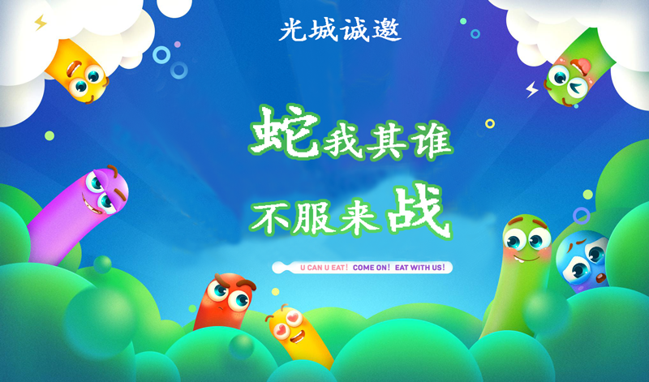
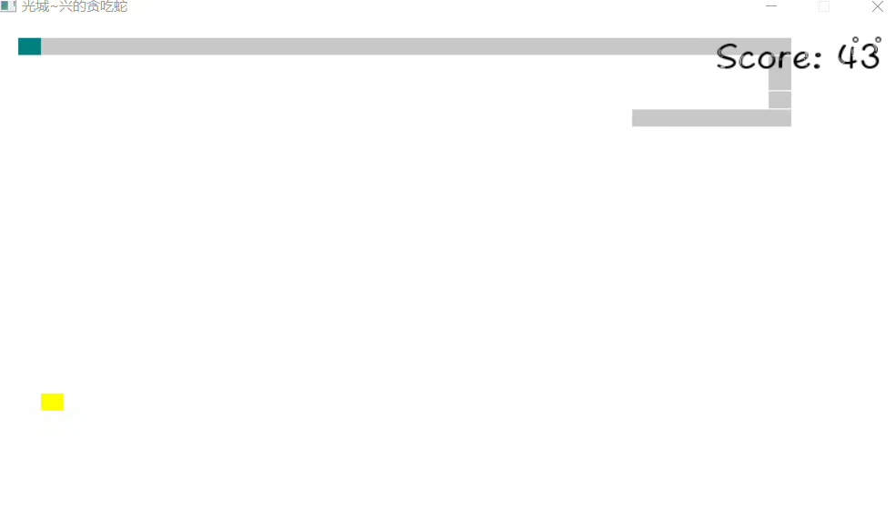
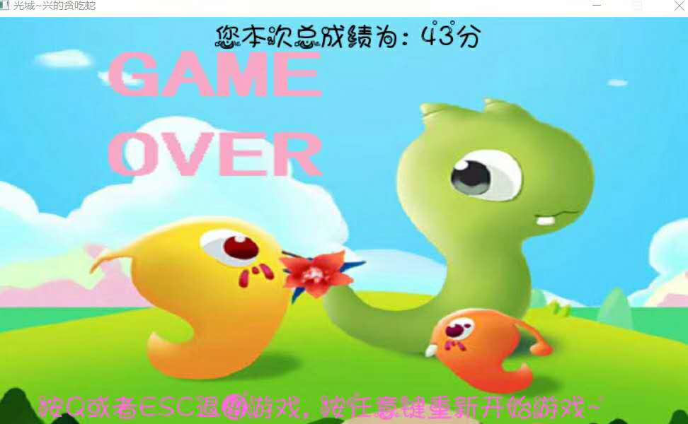

# 一款沉淀多年记忆的游戏

## 0.导语

从儿时就开始见证贪吃蛇游戏的成长，这是一款影响多代人的游戏，同时具有一定的文化积淀！

关于贪吃蛇游戏简介，就不多说了，这次根据平时娱乐，无聊打发时间，采用面向对象思想，实现贪吃蛇。
开发语言为python，库用pygame!

现在开源**2019年第三个开源项目**：**面向对象设计贪吃蛇游戏！**

项目已经开源，地址如下：

> https://github.com/Light-City/snake

还是老话：**欢迎star，fork，转发，收藏！**

## 2.如何玩

【**方式一**】

直接运行exe桌面程序，为了大家更好的体验已经打包贪吃蛇为exe程序，大家在公众号回复**贪吃蛇**，即可获取exe程序链接，下载后，即可玩！

【**方拾二**】

如果你是一个geek，喜欢geek精神，那么请去github上下载源码，运行即可！

## 3.项目简介

- [x] 方向键控制

可通过wasd或方向键控制

- [x] 音效

加载启动与运行音效

- [x] 方法

采用面向对象思想开发，类封装

- [x] 界面

python的pygame开发

## 4.项目截图

- [x] **游戏开始**

- [x] **游戏运行**

- [x] **游戏结束**

